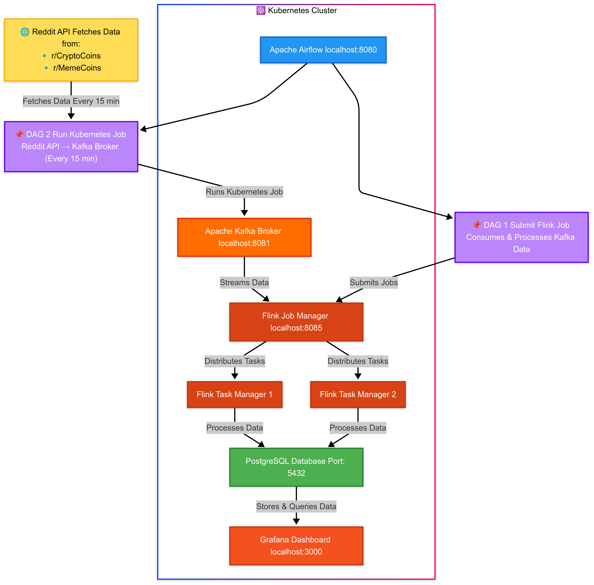

# **Crypto-Gamble Deployment Guide**

## **Project Overview**
Crypto-Gamble is a cloud-native real-time analytics platform designed to process and analyze sentiment data from social media regarding meme coins. The platform leverages Kubernetes, Apache Kafka, Apache Flink, Airflow, and PostgreSQL to provide a scalable and resilient data pipeline. The key advantage of this system is that all components are locally deployed, making it easy to set up and run while allowing seamless scaling into a Kubernetes cluster for production environments.

This project processes **Reddit posts** to extract insights about meme coin sentiment trends. Data is ingested via Kafka, processed with Flink, orchestrated by Airflow, and stored in PostgreSQL. Grafana is used to visualize key metrics.

## **Architecture Diagram**



## **Data Flow & Metrics**
### **Data Flow**
1. **Reddit Post Extraction**: Reddit posts related to meme coins are collected and sent to Kafka.
2. **Kafka Streaming**: The data is pushed into Kafka topics for real-time processing.
3. **Flink Processing**: Flink consumes data from Kafka, performs transformations, and generates sentiment analysis.
4. **Airflow Orchestration**: Airflow schedules and manages data pipeline execution.
5. **PostgreSQL Storage**: Processed data is stored in PostgreSQL for further analysis.
6. **Grafana Visualization**: The data is visualized through dashboards to monitor sentiment trends and engagement metrics.

### **Kafka Producer Requirements**
The Kafka producer requires **user client credentials** to authenticate and send data to the Kafka cluster. Ensure that proper authentication mechanisms, such as SSL or SASL, are configured if deploying on a production cluster.

### **Grafana Metrics**
Grafana is integrated with PostgreSQL to provide real-time analytics on Reddit discussions related to meme coins. The key visualizations include:
- **Total Distinct Posts**: Count of unique posts processed.
- **Distinct Meme Coins**: Number of different meme coins mentioned.
- **Trending Meme Coins**: Bar chart showing meme coins with the highest mentions.
- **Average Sentiment Score**: Time-series chart of average sentiment scores over time.
- **Top Coin Based on Popularity**: Table showing most mentioned meme coins, upvotes, and average sentiment.
- **Most Active Subreddits**: List of subreddits contributing the most to meme coin discussions.

---

## **Prerequisites**
Before starting, ensure you have the following installed:
- [Docker](https://docs.docker.com/get-docker/)
- [Minikube](https://minikube.sigs.k8s.io/docs/start/)
- [Kubectl](https://kubernetes.io/docs/tasks/tools/)
- [Helm](https://helm.sh/docs/intro/install/)

---

## **1. Configure Environment Variables**
Before deploying the system, create a `.env` file to store required credentials and configuration values.

### **1.1 Create the `.env` File**
Copy the example environment file and rename it:
```sh
cp example.env .env
```

### **1.2 Fill in Required Values**
Edit `.env` and fill in the required credentials:
```ini
# Reddit API Credentials
REDDIT_CLIENT_ID="your-client-id"
REDDIT_CLIENT_SECRET="your-client-secret"
REDDIT_USER_AGENT="your-user-agent"

# Kafka Configuration
KAFKA_BROKER="kafka.crypto-gamble.svc.cluster.local:9092"
KAFKA_TOPIC="reddit-topic"
KAFKA_GROUP_ID="reddit-consumer-group"

# Flink & PostgreSQL Configuration
POSTGRES_URL="jdbc:postgresql://postgres.crypto-gamble.svc.cluster.local:5432/reddit"
KAFKA_SOURCE_TABLE="reddit_source"

# PostgreSQL Database
POSTGRES_USER="postgres"
POSTGRES_PASSWORD="postgres"
POSTGRES_DATABASE="postgres"
REDDIT_DATABASE="reddit"
REDDIT_POSTS_TABLE="reddit_posts"
AIRFLOW_DATABASE="airflow"

# PgAdmin Credentials
PGADMIN_DEFAULT_EMAIL="admin@admin.com"  # Change this to your email
PGADMIN_DEFAULT_PASSWORD="admin" # Change this to your password
```

Ensure that the `.env` file is properly configured before deploying the system.

---

## **2. Start Minikube**
Spin up Minikube with allocated resources:
```sh
minikube start --memory=8192 --cpus=4 --driver=docker
# OR
minikube start --memory=10240 --cpus=6 --driver=docker
```

Verify Minikube is running:
```sh
minikube status
```

---

## **3. Apply Kubernetes Configurations**
Create a namespace:
```sh
kubectl create namespace crypto-gamble
```

Apply all Kubernetes configurations (deploys Kafka and Flink deployments):
```sh
kubectl apply -f k8s/ -n crypto-gamble
```

Verify deployed resources:
```sh
kubectl get pods -n crypto-gamble
```

**(Insert Image: Screenshot of deployed pods)**

---

## **4. Install and Configure Airflow using Helm**
Install Airflow:
```sh
helm install airflow apache-airflow/airflow -n crypto-gamble -f k8s/airflow-values.yml
```

Upgrade Airflow:
```sh
helm upgrade airflow apache-airflow/airflow -n crypto-gamble -f k8s/airflow-values.yml
```

Verify Airflow installation:
```sh
kubectl get pods -n crypto-gamble
```

**(Insert Image: Screenshot of running Airflow pods)**

---

## **5. Mount DAGs to Airflow**
To enable live DAG synchronization, mount the DAGs directory inside Minikube:
```sh
minikube mount /path/to/your/local/dags:/mnt/data/airflow-dags
```
Replace `/path/to/your/local/dags` with the actual path where your DAGs are stored.

For manual syncing, delete the existing DAGs PVC and reapply:
```sh
kubectl delete pvc airflow-dags-pvc -n crypto-gamble
kubectl apply -f k8s/airflow-pvc.yml -n crypto-gamble
```

---

## **6. Expose User Interfaces**
To access the various UIs, run the following port-forward commands:

### **Kafka UI**
```sh
kubectl port-forward svc/kafka-ui 8085:8080 -n crypto-gamble
```
**Access Kafka UI at:** `http://localhost:8085`

### **Flink UI**
```sh
kubectl port-forward svc/flink-jobmanager 8081:8081 -n crypto-gamble
```
**Access Flink UI at:** `http://localhost:8081`

### **Airflow UI**
```sh
kubectl port-forward svc/airflow-webserver 8080:8080 --namespace crypto-gamble
```
**Access Airflow UI at:** `http://localhost:8080`

### **Grafana UI**
```sh
kubectl port-forward svc/grafana-service -n crypto-gamble 3000:3000
```
**Access Grafana UI at:** `http://localhost:3000`

---

## **Final Steps**
To clean up and remove resources:
```sh
kubectl delete namespace crypto-gamble
minikube stop
```

