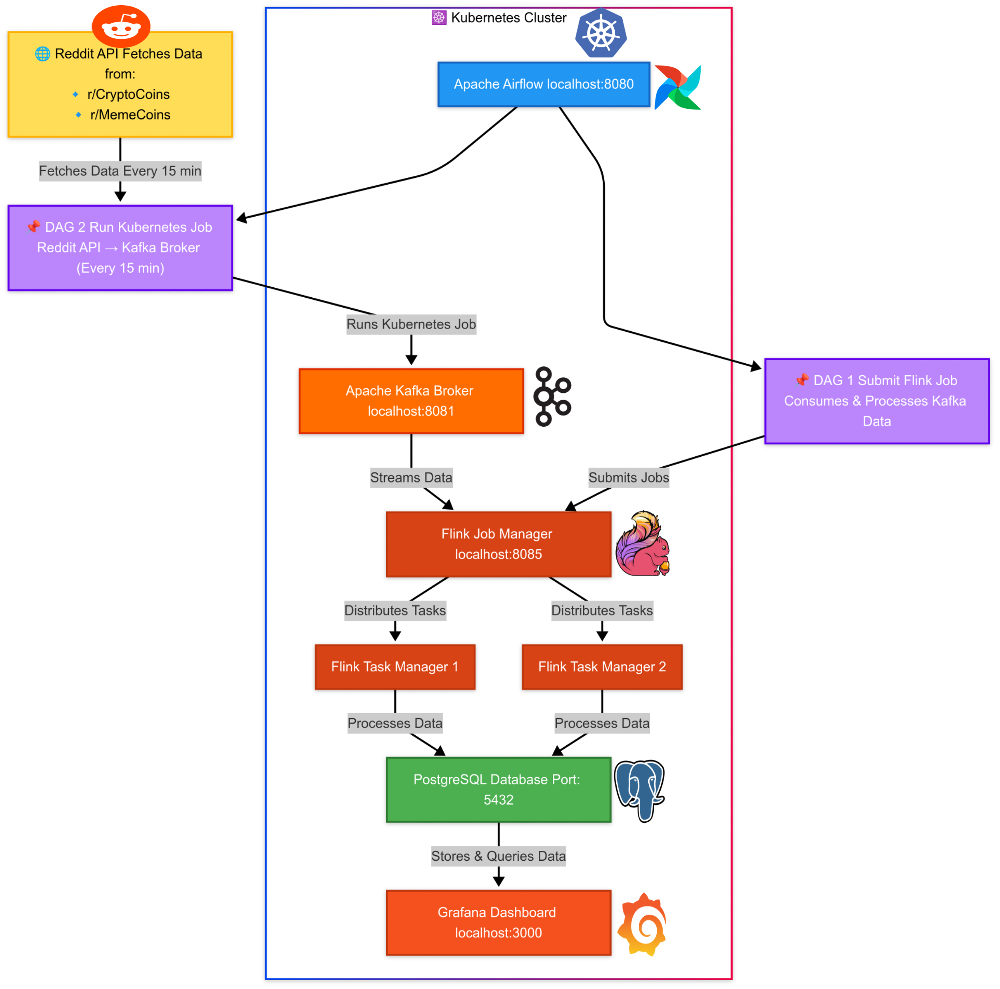
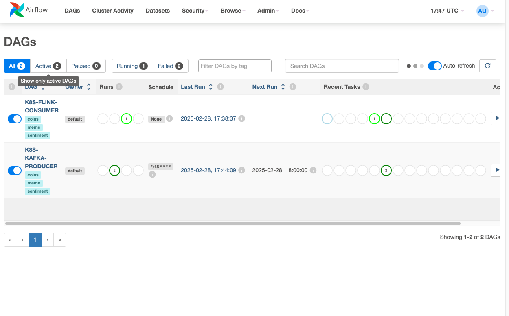
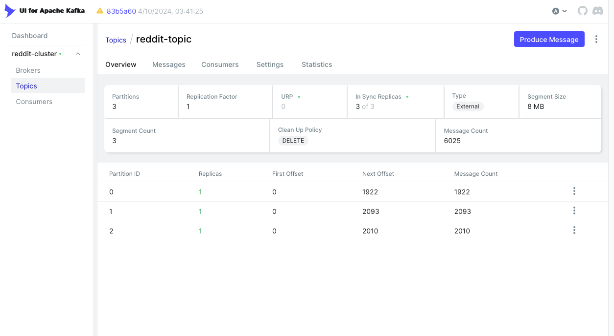
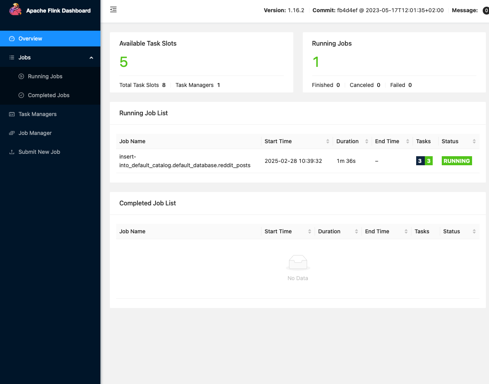
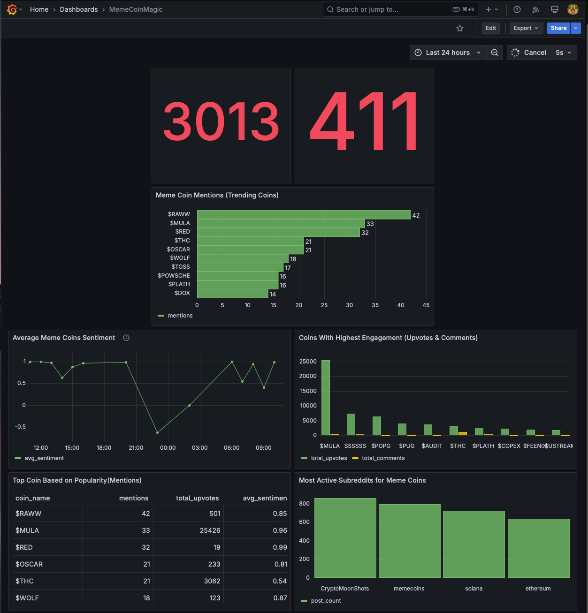

# Crypto-Gamble Deployment Guide

## Introduction
Crypto-Gamble is a **cloud-native real-time analytics platform** designed to process and analyze social media sentiment data on meme coins. The system leverages **Kubernetes, Apache Kafka, Apache Flink, Apache Airflow, and PostgreSQL** to provide a scalable, resilient data pipeline that operates both locally and in production clusters.

## Architecture Diagram
<p align="center" style="background-color: #1e1e1e; padding: 20px; border-radius: 15px; border: 3px solid #4caf50; box-shadow: 0px 0px 10px #4caf50;">
  
</p>

## Key Features
- **Real-time sentiment analysis** from Reddit posts.
- **Kafka-based streaming architecture** for scalability.
- **Flink for high-speed processing** of social media data.
- **Airflow for pipeline orchestration.**
- **PostgreSQL for structured storage and querying.**
- **Grafana dashboards** for real-time visualization.
- **Datadog integration** for monitoring and alerting.

## System Workflow
1. **Reddit Post Extraction**: Collects posts related to meme coins.
2. **Kafka Streaming**: Sends raw data into Kafka topics.
3. **Flink Processing**: Cleans, transforms, and analyzes sentiment.
4. **Airflow Orchestration**: Automates pipeline execution.
5. **PostgreSQL Storage**: Stores processed data for further use.
6. **Grafana Visualization**: Displays insights through dashboards.
7. **Monitoring with Datadog**: Tracks system performance and health.


## Prerequisites
Ensure you have the following installed before deployment:
- **Docker**
- **Minikube**
- **Kubectl**
- **Helm**
- **Git**

## Deployment Steps
### Step 1: Configure Environment Variables
Create and populate a `.env` file:
```sh
cp example.env .env
```
Edit `.env` with your credentials and configurations.

### Step 2: Start Minikube
```sh
minikube start --memory=8192 --cpus=4 --driver=docker
```
Verify Minikube is running:
```sh
minikube status
```

### Step 3: Load Docker Images
```sh
docker build -t flink-consumer:latest -f ./flink_consumer/Dockerfile .
minikube image load flink-consumer:latest

docker build -t kafka-producer:latest -f ./kafka_producer/Dockerfile .
minikube image load kafka-producer:latest
```

### Step 4: Deploy Kubernetes Resources
Create a namespace:
```sh
kubectl create namespace crypto-gamble
```
Apply Kubernetes configurations:
```sh
kubectl apply -f k8s/ -n crypto-gamble
```
Verify deployments:
```sh
kubectl get pods -n crypto-gamble
```

### Step 5: Mount DAGs to Airflow
```sh
minikube mount airflow/dags:/mnt/data/airflow-dags
```
Replace `/path/to/your/local/dags` with the actual DAGs directory.

For manual syncing:
```sh
kubectl delete pvc airflow-dags-pvc -n crypto-gamble
kubectl apply -f k8s/airflow-pvc.yml -n crypto-gamble
```

### Step 6: Install and Configure Airflow
```sh
helm install airflow apache-airflow/airflow -n crypto-gamble -f k8s/airflow-values.yml
```
Verify Airflow installation:
```sh
kubectl get pods -n crypto-gamble
```

### Step 7: Install and Configure Datadogs Agent
Intall Helm Chart for Datadog Agent
```sh
helm repo add datadog https://helm.datadoghq.com
helm repo update
```
```sh
kubectl create secret generic datadog-secret \
  --from-literal api-key=<YOUR_API_KEY> \
  -n crypto-gamble
```


```sh
helm install datadog-agent datadog/datadog -n crypto-gamble -f k8s/datadog-agent-values.yml
```

```sh
helm upgrade datadog-agent datadog/datadog -n crypto-gamble -f k8s/datadog-agent-values.yml
helm uninstall datadog-agent -n crypto-gamble
```

Verify Airflow installation:
```sh
kubectl get pods -n crypto-gamble
```

## Accessing User Interfaces
### Airflow UI
```sh
kubectl port-forward svc/airflow-api-server 8080:8080 -n crypto-gamble
```
[Access Airflow UI](http://localhost:8080)
<p align="center" style="background-color: #1e1e1e; padding: 20px; border-radius: 15px; border: 3px solid #4caf50; box-shadow: 0px 0px 10px #4caf50;">
  
</p>

### Kafka UI
```sh
kubectl port-forward svc/kafka-ui 8085:8080 -n crypto-gamble
```
[Access Kafka UI](http://localhost:8085)
<p align="center" style="background-color: #1e1e1e; padding: 20px; border-radius: 15px; border: 3px solid #4caf50; box-shadow: 0px 0px 10px #4caf50;">
  
</p>

### Flink UI
```sh
kubectl port-forward svc/jobmanager 8081:8081 -n crypto-gamble
```
[Access Flink UI](http://localhost:8081)
<p align="center" style="background-color: #1e1e1e; padding: 20px; border-radius: 15px; border: 3px solid #4caf50; box-shadow: 0px 0px 10px #4caf50;">
  
</p>

### Grafana UI
```sh
kubectl port-forward svc/grafana-service 3000:3000 -n crypto-gamble
```
[Access Grafana UI](http://localhost:3000)
<p align="center" style="background-color: #1e1e1e; padding: 20px; border-radius: 15px; border: 3px solid #4caf50; box-shadow: 0px 0px 10px #4caf50;">
  
</p>

#### Configure Grafana
1. **Login Credentials**
   - Username: `admin`
   - Password: `admin`
2. **Create Data Source**
   - Navigate to `Settings` → `Data Sources` → `Add Data Source`
   - Select **PostgreSQL** and enter connection details
    - URL: `postgresql:5432`
    - Database: `reddit`
   - Click **Save & Test**
3. **Import Dashboard**
   - Go to `Dashboards` → `Import`
   - Upload `garfana_dashboard/MemeCoinMagic-Dashboard.json`
   - Click **Import**

## Cleanup and Teardown
To remove all resources:
```sh
kubectl delete namespace crypto-gamble
minikube stop
```